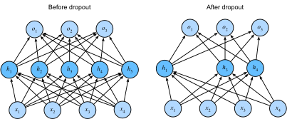

# Abbrecherin
:label:`sec_dropout`

In :numref:`sec_weight_decay` haben wir den klassischen Ansatz zur Regularisierung statistischer Modelle eingeführt, indem wir die Norm $L_2$ der Gewichte bestrafen. In probabilistischer Hinsicht könnten wir diese Technik rechtfertigen, indem wir argumentieren, dass wir eine vorherige Überzeugung angenommen haben, dass Gewichte Werte aus einer Gaußschen Verteilung mit mittlerer Null annehmen. Intuitiv könnten wir argumentieren, dass wir das Modell ermutigt haben, seine Gewichte auf viele Features zu verteilen, anstatt zu stark von einer kleinen Anzahl potenziell falschiger Assoziationen abhängig zu machen.

## Überrüstung Revisited

Angesichts von mehr Features als Beispielen neigen lineare Modelle dazu, zu überpassen. Aber bei mehr Beispielen als Features können wir im Allgemeinen darauf zählen, dass lineare Modelle nicht überpassen. Leider ist die Zuverlässigkeit, mit der lineare Modelle verallgemeinern, kostengünstig. Naiv angewandte lineare Modelle berücksichtigen Interaktionen zwischen Features nicht. Für jedes Feature muss ein lineares Modell entweder eine positive oder eine negative Gewichtung zuweisen, wobei der Kontext ignoriert wird.

In traditionellen Texten wird diese fundamentale Spannung zwischen Verallgemeinerbarkeit und Flexibilität als „Bias-Varianz-Kompromiss“ beschrieben. Lineare Modelle haben eine hohe Voreingenommenheit: Sie können nur eine kleine Klasse von Funktionen darstellen. Diese Modelle weisen jedoch eine geringe Varianz auf: Sie liefern ähnliche Ergebnisse für verschiedene Stichproben der Daten.

Tiefe neuronale Netze bewohnen das gegenüberliegende Ende des Bias-Varianz-Spektrums. Im Gegensatz zu linearen Modellen sind neuronale Netze nicht darauf beschränkt, jedes Feature einzeln zu betrachten. Sie können Interaktionen zwischen Gruppen von Features lernen. Beispielsweise können sie daraus schließen, dass „Nigeria“ und „Western Union“, die zusammen in einer E-Mail erscheinen, Spam anzeigt, aber separat nicht.

Selbst wenn wir weit mehr Beispiele als Merkmale haben, sind tiefe neuronale Netze in der Lage, zu überpassen. Im Jahr 2017 demonstrierte eine Gruppe von Forschern die extreme Flexibilität neuronaler Netzwerke, indem tiefe Netze auf zufällig markierten Bildern trainiert wurden. Trotz des Fehlens eines echten Musters, das die Eingänge mit den Ausgängen verbindet, fanden sie heraus, dass das neuronale Netzwerk, das durch stochastische Gradientenabstieg optimiert wurde, jedes Bild im Trainingsset perfekt beschriften konnte. Überlegen Sie, was das bedeutet. Wenn die Beschriftungen einheitlich zufällig zugewiesen werden und es 10 Klassen gibt, kann kein Klassifikator besser als 10% Genauigkeit bei Aushaltedaten machen. Die Verallgemeinerlücke hier ist satte 90%. Wenn unsere Modelle so ausdrucksstark sind, dass sie dies schlecht überpassen können, wann sollten wir dann erwarten, dass sie nicht überpassen?

Die mathematischen Grundlagen für die rätselhaften Verallgemeinerungseigenschaften von tiefen Netzwerken bleiben offene Forschungsfragen, und wir ermutigen den theoretisch orientierten Leser, sich tiefer in das Thema zu vertiefen. Im Moment wenden wir uns der Untersuchung praktischer Werkzeuge zu, die dazu neigen, die Verallgemeinerung tiefer Netze empirisch zu verbessern.

## Robustheit durch Störungen

Lassen Sie uns kurz darüber nachdenken, was wir von einem guten Vorhersagemodell erwarten. Wir wollen, dass es gut auf unsichtbaren Daten abbildet. Klassische Generalisierungstheorie legt nahe, dass wir, um die Lücke zwischen Zug- und Testleistung zu schließen, ein einfaches Modell anstreben sollten. Einfachheit kann in Form einer kleinen Anzahl von Dimensionen kommen. Dies haben wir bei der Erörterung der monomialen Basisfunktionen linearer Modelle in :numref:`sec_model_selection` untersucht. Darüber hinaus, wie wir bei der Diskussion von Gewichtszerfall ($L_2$ Regularisierung) in :numref:`sec_weight_decay` gesehen haben, stellt die (umgekehrte) Norm der Parameter auch ein nützliches Maß für Einfachheit dar. Ein weiterer nützlicher Begriff der Einfachheit ist Glätte, d.h., dass die Funktion nicht empfindlich auf kleine Änderungen an ihren Eingängen reagieren sollte. Wenn wir zum Beispiel Bilder klassifizieren, würden wir erwarten, dass das Hinzufügen von zufälligen Rauschen zu den Pixeln meist harmlos sein sollte.

Im Jahr 1995 formalisierte Christopher Bischof diese Idee, als er bewies, dass das Training mit Eingangsgeräuschen der Tichonov-Regularisierung :cite:`Bishop.1995` entspricht. Diese Arbeit zog eine klare mathematische Verbindung zwischen der Anforderung, dass eine Funktion glatt (und somit einfach) ist, und der Anforderung, dass sie widerstandsfähig gegen Störungen in der Eingabe ist.

Dann entwickelte Srivastava et al. :cite:`Srivastava.Hinton.Krizhevsky.ea.2014` 2014 eine clevere Idee, wie man die Idee von Bishop auch auf die inneren Schichten eines Netzwerks anwenden kann. Sie schlugen nämlich vor, Lärm in jede Schicht des Netzwerks zu injizieren, bevor die nachfolgende Schicht während des Trainings berechnet wird. Sie erkannten, dass beim Training eines tiefen Netzwerks mit vielen Schichten das Einspritzen von Rauschen die Glätte nur auf dem Eingabe-Output-Mapping erzwingt.

Ihre Idee, *Dropout* genannt, beinhaltet das Einspritzen von Rauschen während der Berechnung jeder internen Schicht während der Vorwärtsausbreitung, und es ist zu einer Standardtechnik für das Training neuronaler Netzwerke geworden. Die Methode heißt *dropout*, weil wir buchstäblich
*fallen aus* einige Neuronen während des Trainings.
Während des gesamten Trainings besteht bei jeder Iteration das Standard-Dropout darin, einen Bruchteil der Knoten in jeder Ebene auf Null zu setzen, bevor die nachfolgende Schicht berechnet wird.

Um klar zu sein, wir setzen unsere eigene Erzählung mit der Verbindung zu Bischof auf. Das Originalpapier auf Dropout bietet Intuition durch eine überraschende Analogie zur sexuellen Reproduktion. Die Autoren argumentieren, dass das Überpassen des neuronalen Netzwerks durch einen Zustand gekennzeichnet ist, in dem jede Schicht auf ein bestimmtes Muster von Aktivierungen in der vorherigen Ebene beruht und diese Bedingung *Co-Adaptation* genannt wird. Dropout, so behaupten sie, bricht die Ko-Anpassung auf, so wie sexuelle Reproduktion argumentiert wird, um ko-angepasste Gene aufzubrechen.

Die entscheidende Herausforderung ist dann, wie man dieses Rauschen injiziert. Eine Idee besteht darin, das Rauschen in einer *unvoreingenommen* Weise zu injizieren, so dass der erwartete Wert jeder Schicht — während die anderen fixiert wird — dem Wert entspricht, den er ohne Rauschen genommen hätte.

In Bishop's Arbeit fügte er den Eingängen zu einem linearen Modell Gaußschen Rauschen hinzu. Bei jeder Trainingsiteration fügte er dem Eingang $\mathbf{x}$ ein Rauschen hinzu, das aus einer Verteilung mit mittlerer Null $\epsilon \sim \mathcal{N}(0,\sigma^2)$ abgetastet wurde, was zu einem störenden Punkt $\mathbf{x}' = \mathbf{x} + \epsilon$ führte. In Erwartung, $E[\mathbf{x}'] = \mathbf{x}$.

Bei der Standard-Dropout-Regularisierung debiases jeder Schicht durch Normalisierung durch den Bruchteil der Knoten, die beibehalten wurden (nicht gelöscht). Mit anderen Worten, mit *Ausfallwahrscheinlichkeit* $p$ wird jede Zwischenaktivierung $h$ durch eine Zufallsvariable $h'$ wie folgt ersetzt:

$$
\begin{aligned}
h' =
\begin{cases}
    0 & \text{ with probability } p \\
    \frac{h}{1-p} & \text{ otherwise}
\end{cases}
\end{aligned}
$$

Vom Entwurf bleibt die Erwartung unverändert, d.h. $E[h'] = h$.

## Dropout in der Praxis

Rufen Sie die MLP mit einer versteckten Ebene und 5 versteckten Einheiten in :numref:`fig_mlp` auf. Wenn wir Dropout auf eine versteckte Schicht anwenden, wobei jede versteckte Einheit mit Wahrscheinlichkeit $p$ auf Null gesetzt wird, kann das Ergebnis als Netzwerk betrachtet werden, das nur eine Teilmenge der ursprünglichen Neuronen enthält. In :numref:`fig_dropout2` werden $h_2$ und $h_5$ entfernt. Folglich hängt die Berechnung der Ausgänge nicht mehr von $h_2$ oder $h_5$ ab und ihr jeweiliger Gradient verschwindet auch bei der Rückverbreitung. Auf diese Weise kann die Berechnung des Ausgabe-Layers nicht allzu stark von einem Element von $h_1, \ldots, h_5$ abhängig sein.


:label:`fig_dropout2`

In der Regel deaktivieren wir Dropout zum Testzeitpunkt. Bei einem trainierten Modell und einem neuen Beispiel fallen wir keine Knoten aus und müssen daher nicht normalisieren. Es gibt jedoch einige Ausnahmen: Einige Forscher verwenden Dropout zur Testzeit als Heuristik, um die *Unsicherheit* von Vorhersagen des neuronalen Netzes zu schätzen: Wenn die Vorhersagen über viele verschiedene Dropout-Masken übereinstimmen, dann könnten wir sagen, dass das Netzwerk sicherer ist.

## Implementierung von Grund auf neu

Um die Dropout-Funktion für eine einzelne Ebene zu implementieren, müssen wir so viele Samples aus einer Bernoulli (binäre) Zufallsvariable ziehen, wie unsere Ebene Dimensionen hat, wobei die Zufallsvariable den Wert $1$ (halten) mit der Wahrscheinlichkeit $1-p$ und $0$ (drop) mit der Wahrscheinlichkeit $p$ annimmt. Eine einfache Möglichkeit, dies zu implementieren, besteht darin, zunächst Proben aus der einheitlichen Verteilung $U[0, 1]$ zu ziehen. Dann können wir die Knoten behalten, für die die entsprechende Probe größer als $p$ ist und den Rest fallen lassen.

Im folgenden Code implementieren wir eine `dropout_layer`-Funktion, die die Elemente in der Tensor-Eingabe `X` mit Wahrscheinlichkeit `dropout` herausfällt und den Rest wie oben beschrieben neu skaliert: Division der Überlebenden durch `1.0-dropout`.

```{.python .input}
from d2l import mxnet as d2l
from mxnet import autograd, gluon, init, np, npx
from mxnet.gluon import nn
npx.set_np()

def dropout_layer(X, dropout):
    assert 0 <= dropout <= 1
    # In this case, all elements are dropped out
    if dropout == 1:
        return np.zeros_like(X)
    # In this case, all elements are kept
    if dropout == 0:
        return X
    mask = np.random.uniform(0, 1, X.shape) > dropout
    return mask.astype(np.float32) * X / (1.0 - dropout)
```

```{.python .input}
#@tab pytorch
from d2l import torch as d2l
import torch
from torch import nn

def dropout_layer(X, dropout):
    assert 0 <= dropout <= 1
    # In this case, all elements are dropped out
    if dropout == 1:
        return torch.zeros_like(X)
    # In this case, all elements are kept
    if dropout == 0:
        return X
    mask = (torch.Tensor(X.shape).uniform_(0, 1) > dropout).float()
    return mask * X / (1.0 - dropout)
```

```{.python .input}
#@tab tensorflow
from d2l import tensorflow as d2l
import tensorflow as tf

def dropout_layer(X, dropout):
    assert 0 <= dropout <= 1
    # In this case, all elements are dropped out
    if dropout == 1:
        return tf.zeros_like(X)
    # In this case, all elements are kept
    if dropout == 0:
        return X
    mask = tf.random.uniform(
        shape=tf.shape(X), minval=0, maxval=1) < 1 - dropout
    return tf.cast(mask, dtype=tf.float32) * X / (1.0 - dropout)
```

Wir können die Funktion `dropout_layer` an einigen Beispielen testen. In den folgenden Codezeilen übergeben wir unsere Eingabe `X` durch die Dropout-Operation mit Wahrscheinlichkeiten 0, 0,5 und 1.

```{.python .input}
X = np.arange(16).reshape(2, 8)
print(dropout_layer(X, 0))
print(dropout_layer(X, 0.5))
print(dropout_layer(X, 1))
```

```{.python .input}
#@tab pytorch
X= torch.arange(16, dtype = torch.float32).reshape((2, 8))
print(X)
print(dropout_layer(X, 0.))
print(dropout_layer(X, 0.5))
print(dropout_layer(X, 1.))
```

```{.python .input}
#@tab tensorflow
X = tf.reshape(tf.range(16, dtype=tf.float32), (2, 8))
print(X)
print(dropout_layer(X, 0.))
print(dropout_layer(X, 0.5))
print(dropout_layer(X, 1.))
```

### Definieren von Modellparametern

Auch hier arbeiten wir mit dem Fashion-MNIST-Datensatz, der in :numref:`sec_fashion_mnist` eingeführt wurde. Wir definieren einen MLP mit zwei versteckten Schichten, die jeweils 256 Einheiten enthalten.

```{.python .input}
num_inputs, num_outputs, num_hiddens1, num_hiddens2 = 784, 10, 256, 256

W1 = np.random.normal(scale=0.01, size=(num_inputs, num_hiddens1))
b1 = np.zeros(num_hiddens1)
W2 = np.random.normal(scale=0.01, size=(num_hiddens1, num_hiddens2))
b2 = np.zeros(num_hiddens2)
W3 = np.random.normal(scale=0.01, size=(num_hiddens2, num_outputs))
b3 = np.zeros(num_outputs)

params = [W1, b1, W2, b2, W3, b3]
for param in params:
    param.attach_grad()
```

```{.python .input}
#@tab pytorch
num_inputs, num_outputs, num_hiddens1, num_hiddens2 = 784, 10, 256, 256
```

```{.python .input}
#@tab tensorflow
num_outputs, num_hiddens1, num_hiddens2 = 10, 256, 256
```

### Definieren des Modells

Das folgende Modell wendet Dropout auf die Ausgabe jeder ausgeblendeten Ebene an (nach der Aktivierungsfunktion). Wir können Ausfallwahrscheinlichkeiten für jede Ebene separat festlegen. Ein häufiger Trend besteht darin, eine niedrigere Ausfallwahrscheinlichkeit näher am Eingabe-Layer festzulegen. Unten setzen wir es auf 0,2 und 0,5 für die erste und zweite versteckte Schicht. Wir sorgen dafür, dass Dropout nur während des Trainings aktiv ist.

```{.python .input}
dropout1, dropout2 = 0.2, 0.5

def net(X):
    X = X.reshape(-1, num_inputs)
    H1 = npx.relu(np.dot(X, W1) + b1)
    # Use dropout only when training the model
    if autograd.is_training():
        # Add a dropout layer after the first fully connected layer
        H1 = dropout_layer(H1, dropout1)
    H2 = npx.relu(np.dot(H1, W2) + b2)
    if autograd.is_training():
        # Add a dropout layer after the second fully connected layer
        H2 = dropout_layer(H2, dropout2)
    return np.dot(H2, W3) + b3
```

```{.python .input}
#@tab pytorch
dropout1, dropout2 = 0.2, 0.5

class Net(nn.Module):
    def __init__(self, num_inputs, num_outputs, num_hiddens1, num_hiddens2,
                 is_training = True):
        super(Net, self).__init__()

        self.num_inputs = num_inputs
        self.training = is_training

        self.lin1 = nn.Linear(num_inputs, num_hiddens1)
        self.lin2 = nn.Linear(num_hiddens1, num_hiddens2)
        self.lin3 = nn.Linear(num_hiddens2, num_outputs)

        self.relu = nn.ReLU()

    def forward(self, X):
        H1 = self.relu(self.lin1(X.reshape((-1, self.num_inputs))))
        # Use dropout only when training the model
        if self.training == True:
            # Add a dropout layer after the first fully connected layer
            H1 = dropout_layer(H1, dropout1)
        H2 = self.relu(self.lin2(H1))
        if self.training == True:
            # Add a dropout layer after the second fully connected layer
            H2 = dropout_layer(H2, dropout2)
        out = self.lin3(H2)
        return out


net = Net(num_inputs, num_outputs, num_hiddens1, num_hiddens2)
```

```{.python .input}
#@tab tensorflow
dropout1, dropout2 = 0.2, 0.5

class Net(tf.keras.Model):
    def __init__(self, num_outputs, num_hiddens1, num_hiddens2):
        super().__init__()
        self.input_layer = tf.keras.layers.Flatten()
        self.hidden1 = tf.keras.layers.Dense(num_hiddens1, activation='relu')
        self.hidden2 = tf.keras.layers.Dense(num_hiddens2, activation='relu')
        self.output_layer = tf.keras.layers.Dense(num_outputs)

    def call(self, inputs, training=None):
        x = self.input_layer(inputs)
        x = self.hidden1(x)
        if training:
            x = dropout_layer(x, dropout1)
        x = self.hidden2(x)
        if training:
            x = dropout_layer(x, dropout2)
        x = self.output_layer(x)
        return x

net = Net(num_outputs, num_hiddens1, num_hiddens2)
```

### Schulung und Testen

Dies ist vergleichbar mit dem Training und Testen von MLPs, die zuvor beschrieben wurden.

```{.python .input}
num_epochs, lr, batch_size = 10, 0.5, 256
loss = gluon.loss.SoftmaxCrossEntropyLoss()
train_iter, test_iter = d2l.load_data_fashion_mnist(batch_size)
d2l.train_ch3(net, train_iter, test_iter, loss, num_epochs,
              lambda batch_size: d2l.sgd(params, lr, batch_size))
```

```{.python .input}
#@tab pytorch
num_epochs, lr, batch_size = 10, 0.5, 256
loss = nn.CrossEntropyLoss()
train_iter, test_iter = d2l.load_data_fashion_mnist(batch_size)
trainer = torch.optim.SGD(net.parameters(), lr=lr)
d2l.train_ch3(net, train_iter, test_iter, loss, num_epochs, trainer)
```

```{.python .input}
#@tab tensorflow
num_epochs, lr, batch_size = 10, 0.5, 256
loss = tf.keras.losses.SparseCategoricalCrossentropy(from_logits=True)
train_iter, test_iter = d2l.load_data_fashion_mnist(batch_size)
trainer = tf.keras.optimizers.SGD(learning_rate=lr)
d2l.train_ch3(net, train_iter, test_iter, loss, num_epochs, trainer)
```

## Prägnante Implementierung

Bei High-Level-APIs müssen wir nur eine `Dropout`-Schicht nach jeder vollständig verbundenen Schicht hinzufügen, wobei die Dropout-Wahrscheinlichkeit als einziges Argument an ihren Konstruktor übergeben wird. Während des Trainings wird der Layer `Dropout` nach dem Zufallsprinzip Ausgänge der vorherigen Ebene (oder gleichwertig die Eingaben für die nachfolgende Ebene) entsprechend der angegebenen Ausfallwahrscheinlichkeit ausfallen. Wenn sie sich nicht im Trainingsmodus befindet, übergibt die `Dropout` die Daten während des Tests einfach durch.

```{.python .input}
net = nn.Sequential()
net.add(nn.Dense(256, activation="relu"),
        # Add a dropout layer after the first fully connected layer
        nn.Dropout(dropout1),
        nn.Dense(256, activation="relu"),
        # Add a dropout layer after the second fully connected layer
        nn.Dropout(dropout2),
        nn.Dense(10))
net.initialize(init.Normal(sigma=0.01))
```

```{.python .input}
#@tab pytorch
net = nn.Sequential(nn.Flatten(),
        nn.Linear(784, 256),
        nn.ReLU(),
        # Add a dropout layer after the first fully connected layer
        nn.Dropout(dropout1),
        nn.Linear(256, 256),
        nn.ReLU(),
        # Add a dropout layer after the second fully connected layer
        nn.Dropout(dropout2),
        nn.Linear(256, 10))

def init_weights(m):
    if type(m) == nn.Linear:
        torch.nn.init.normal_(m.weight, std=0.01)

net.apply(init_weights)
```

```{.python .input}
#@tab tensorflow
net = tf.keras.models.Sequential([
    tf.keras.layers.Flatten(),
    tf.keras.layers.Dense(256, activation=tf.nn.relu),
    # Add a dropout layer after the first fully connected layer
    tf.keras.layers.Dropout(dropout1),
    tf.keras.layers.Dense(256, activation=tf.nn.relu),
    # Add a dropout layer after the second fully connected layer
    tf.keras.layers.Dropout(dropout2),
    tf.keras.layers.Dense(10),
])
```

Als nächstes trainieren und testen wir das Modell.

```{.python .input}
trainer = gluon.Trainer(net.collect_params(), 'sgd', {'learning_rate': lr})
d2l.train_ch3(net, train_iter, test_iter, loss, num_epochs, trainer)
```

```{.python .input}
#@tab pytorch
trainer = torch.optim.SGD(net.parameters(), lr=lr)
d2l.train_ch3(net, train_iter, test_iter, loss, num_epochs, trainer)
```

```{.python .input}
#@tab tensorflow
trainer = tf.keras.optimizers.SGD(learning_rate=lr)
d2l.train_ch3(net, train_iter, test_iter, loss, num_epochs, trainer)
```

## Zusammenfassung

* Neben der Kontrolle der Anzahl der Abmessungen und der Größe des Gewichtungsvektors ist Dropout ein weiteres Werkzeug, um Überanpassung zu vermeiden. Oft werden sie gemeinsam verwendet.
* Dropout ersetzt eine Aktivierung $h$ durch eine Zufallsvariable mit erwartetem Wert $h$.
* Dropout wird nur während des Trainings verwendet.

## Übungen

1. Was passiert, wenn Sie die Ausfallwahrscheinlichkeiten für die erste und zweite Ebene ändern? Was passiert insbesondere, wenn Sie die für beide Ebenen wechseln? Entwerfen Sie ein Experiment zur Beantwortung dieser Fragen, beschreiben Sie Ihre Ergebnisse quantitativ und fassen Sie die qualitativen Takeaways zusammen.
1. Erhöhen Sie die Anzahl der Epochen und vergleichen Sie die Ergebnisse, die Sie erhalten, wenn Sie Dropout verwenden, mit denen, wenn Sie es nicht verwenden.
1. Was ist die Varianz der Aktivierungen in jeder ausgeblendeten Ebene, wenn Dropout angewendet wird und nicht? Zeichnen Sie ein Diagramm, um zu zeigen, wie sich diese Größe im Laufe der Zeit für beide Modelle entwickelt.
1. Warum wird Dropout normalerweise nicht zum Testzeitpunkt verwendet?
1. Vergleichen Sie anhand des Modells in diesem Abschnitt die Auswirkungen der Verwendung von Dropout und Gewichtsabfall. Was passiert, wenn Dropout und Gewichtszerfall gleichzeitig verwendet werden? Sind die Ergebnisse additiv? Gibt es verminderte Renditen (oder schlimmer)? Haben sie sich gegenseitig abgesagt?
1. Was passiert, wenn wir Dropout auf die einzelnen Gewichte der Gewichtsmatrix anstatt auf die Aktivierungen anwenden?
1. Erfinden Sie eine andere Technik, um zufällige Rauschen auf jeder Ebene zu injizieren, die sich von der Standard-Dropout-Technik unterscheidet. Können Sie eine Methode entwickeln, die das Dropout im Fashion-MNIST-Dataset übertrifft (für eine feste Architektur)?

:begin_tab:`mxnet`
[Discussions](https://discuss.d2l.ai/t/100)
:end_tab:

:begin_tab:`pytorch`
[Discussions](https://discuss.d2l.ai/t/101)
:end_tab:

:begin_tab:`tensorflow`
[Discussions](https://discuss.d2l.ai/t/261)
:end_tab:
