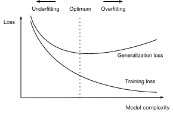

# Modellauswahl, Unterrüstung und Überrüstung
:label:`sec_model_selection`

Als Wissenschaftler des maschinellen Lernens ist es unser Ziel, *Muster* zu entdecken. Aber wie können wir sicher sein, dass wir wirklich ein *allgemein* Muster entdeckt haben und nicht einfach unsere Daten gespeichert haben? Stellen Sie sich zum Beispiel vor, dass wir nach Mustern unter genetischen Markern suchen wollten, die Patienten mit ihrem Demenzstatus verbinden, wo die Etiketten aus dem Set $\{\text{dementia}, \text{mild cognitive impairment}, \text{healthy}\}$ stammen. Da die Gene jeder Person sie eindeutig identifizieren (wobei identische Geschwister ignoriert werden), ist es möglich, den gesamten Datensatz zu speichern.

Wir wollen nicht, dass unser Modell sagt
*„Das ist Bob! Ich erinnere mich an ihn! Er hat Demenz!“*
Der Grund, warum ist einfach. Wenn wir das Modell in der Zukunft bereitstellen, werden wir Patienten treffen, die das Modell noch nie zuvor gesehen hat. Unsere Vorhersagen sind nur dann nützlich, wenn unser Modell wirklich ein *allgemein* Muster entdeckt hat.

Um formeller zu rekapitulieren, ist es unser Ziel, Muster zu entdecken, die Regelmäßigkeiten in der zugrundeliegenden Bevölkerung erfassen, aus der unser Trainingsset gezogen wurde. Wenn wir in diesem Bemühen erfolgreich sind, könnten wir das Risiko auch für Einzelpersonen, die wir noch nie zuvor erlebt haben, erfolgreich einschätzen. Dieses Problem — wie Muster entdeckt werden, die *generalisieren* — ist das grundlegende Problem des maschinellen Lernens.

Die Gefahr besteht darin, dass wir beim Trainieren von Modellen nur auf eine kleine Stichprobe von Daten zugreifen. Die größten öffentlichen Bilddatensätze enthalten ungefähr eine Million Bilder. Häufiger müssen wir nur von Tausenden oder Zehntausenden von Datenpunkten lernen. In einem großen Krankenhaussystem können wir auf Hunderttausende von Krankenakten zugreifen. Wenn wir mit endlichen Stichproben arbeiten, besteht das Risiko, dass wir scheinbare Assoziationen entdecken, die sich herausstellen, dass sie nicht aufhalten, wenn wir mehr Daten sammeln.

Das Phänomen, unsere Trainingsdaten enger anzupassen, als wir der zugrunde liegenden Verteilung entsprechen, wird *overfitting* genannt, und die Techniken, die zur Bekämpfung von Überanpassungen eingesetzt werden, werden *Regularisierung* genannt. In den vorherigen Abschnitten haben Sie diesen Effekt möglicherweise beobachtet, während Sie mit dem Fashion-MNIST-Dataset experimentieren. Wenn Sie während des Experiments die Modellstruktur oder die Hyperparameter geändert haben, haben Sie vielleicht bemerkt, dass das Modell mit genügend Neuronen, Schichten und Trainingsepochen eine perfekte Genauigkeit auf dem Trainingsset erreichen kann, selbst wenn sich die Genauigkeit der Testdaten verschlechtert.

## Schulungsfehler und Generalisierungsfehler

Um dieses Phänomen formeller zu diskutieren, müssen wir zwischen Schulungsfehlern und Verallgemeinerungsfehlern unterscheiden. Der *Trainingsfehler* ist der Fehler unseres Modells, der auf dem Trainingsdatensatz berechnet wird, während *Generalisierungsfehler* die Erwartung des Fehlers unseres Modells ist, wenn wir ihn auf einen unendlichen Strom zusätzlicher Datenpunkte anwenden, die aus derselben zugrunde liegenden Datenverteilung wie unser ursprüngliches Beispiel stammen.

Problematisch können wir den Verallgemeinerungsfehler nie genau berechnen. Das liegt daran, dass der Strom unendlicher Daten ein imaginäres Objekt ist. In der Praxis müssen wir den Generalisierungsfehler *schätzen*, indem wir unser Modell auf einen unabhängigen Testsatz anwenden, der aus einer zufälligen Auswahl von Datenpunkten besteht, die aus unserem Trainingsset zurückgehalten wurden.

Die folgenden drei Gedankenexperimente werden dazu beitragen, diese Situation besser zu veranschaulichen. Betrachten Sie eine College-Studentin, die versucht, sich auf ihre Abschlussprüfung vorzubereiten. Eine fleißige Studentin wird sich bemühen, gut zu üben und ihre Fähigkeiten mit Prüfungen aus früheren Jahren zu testen. Nichtsdestotrotz ist es keine Garantie dafür, dass sie sich übertreffen wird, wenn es darauf ankommt. Zum Beispiel könnte der Student versuchen, sich vorzubereiten, indem er die Antworten auf die Prüfungsfragen lernt. Dies erfordert, dass der Schüler viele Dinge auswendig lernen muss. Sie erinnert sich vielleicht sogar perfekt an die Antworten für vergangene Prüfungen. Ein anderer Schüler könnte sich vorbereiten, indem er versucht, die Gründe für bestimmte Antworten zu verstehen. In den meisten Fällen wird der letztere Schüler viel besser machen.

Berücksichtigen Sie auch ein Modell, das einfach eine Nachschlagetabelle verwendet, um Fragen zu beantworten. Wenn der Satz der zulässigen Eingaben diskret und relativ klein ist, würde dieser Ansatz vielleicht nach dem Betrachten von Beispielen für die Ausbildung gut funktionieren. Dennoch hat dieses Modell keine Möglichkeit, besser zu machen als zufälliges Raten, wenn es mit Beispielen konfrontiert ist, die es noch nie zuvor gesehen hat. In Wirklichkeit sind die Eingaberäume viel zu groß, um die Antworten zu speichern, die jedem erdenklichen Input entsprechen. Betrachten Sie zum Beispiel die Schwarz-Weiß-Bilder $28\times28$. Wenn jedes Pixel einen von $256$ Graustufenwerten annehmen kann, gibt es $256^{784}$ mögliche Bilder. Das bedeutet, dass es weit mehr Graustufenbilder in Thumbnailgröße mit niedriger Auflösung gibt, als es Atome im Universum gibt. Selbst wenn wir auf solche Daten stoßen könnten, könnten wir es uns nie leisten, die Nachschlagetabelle zu speichern.

Betrachten Sie zuletzt das Problem, die Ergebnisse von Münzwürfen (Klasse 0: Köpfe, Klasse 1: Schwänze) basierend auf einigen kontextbezogenen Merkmalen zu klassifizieren, die möglicherweise verfügbar sind. Angenommen, die Münze ist fair. Egal, mit welchem Algorithmus wir kommen, der Generalisierungsfehler wird immer $\frac{1}{2}$ sein. Für die meisten Algorithmen sollten wir jedoch davon ausgehen, dass unser Trainingsfehler je nach Glück der Auslosung erheblich geringer ist, auch wenn wir keine Features hatten! Betrachten Sie den Datensatz {0, 1, 1, 1, 0, 1}. Unser funktionsloser Algorithmus müsste immer darauf zurückgreifen, die *Mehrheitsklasse* vorherzusagen, die aus unserer begrenzten Stichprobe als *1* erscheint. In diesem Fall wird für das Modell, das immer Klasse 1 vorhersagt, ein Fehler von $\frac{1}{3}$ auftreten, der wesentlich besser ist als unser Generalisierungsfehler. Wenn wir die Datenmenge erhöhen, verringert sich die Wahrscheinlichkeit, dass der Anteil der Köpfe signifikant von $\frac{1}{2}$ abweicht, und unser Trainingsfehler würde mit dem Generalisierungsfehler übereinstimmen.

### Statistische Lerntheorie

Da Verallgemeinerung das grundlegende Problem des maschinellen Lernens ist, ist es vielleicht nicht überrascht zu erfahren, dass viele Mathematiker und Theoretiker ihr Leben der Entwicklung formaler Theorien gewidmet haben, um dieses Phänomen zu beschreiben. Glivenko und Cantelli haben in ihrem [gleichnamigen Satz](https://en.wikipedia.org/wiki/Glivenko%E2%80%93Cantelli_theorem) die Rate abgeleitet, mit der der Ausbildungsfehler zum Verallgemeinungsfehler konvergiert. [Vapnik und Chervonenkis](https://en.wikipedia.org/wiki/Vapnik%E2%80%93Chervonenkis_theory) haben diese Theorie in einer Reihe von bahnbrechenden Papieren auf allgemeinere Funktionsklassen ausgeweitet. Diese Arbeit legte die Grundlagen der statistischen Lerntheorie.

In der standardmäßigen überwachten Lerneinstellung, die wir bisher angesprochen haben und in den meisten Teilen dieses Buches bleiben werden, gehen wir davon aus, dass sowohl die Trainingsdaten als auch die Testdaten *unabhängig* aus *identisch* Verteilungen gezogen werden. Dies wird üblicherweise *i.d. Annahme* genannt, was bedeutet, dass der Prozess, der unsere Daten abtasten, keinen Speicher hat. Mit anderen Worten, das zweite gezeichnete und das dritte gezeichnete Beispiel sind nicht mehr korreliert als die zweite und die zweimillionste gezogene Stichprobe.

Ein guter maschineller Lernwissenschaftler zu sein erfordert kritisch zu denken, und schon sollten Sie Löcher in dieser Annahme stochen, kommen mit häufigen Fällen, in denen die Annahme scheitert. Was ist, wenn wir einen Mortalitätsrisikoprädiktor auf Daten, die von Patienten im UCSF Medical Center gesammelt wurden, trainieren und ihn auf Patienten im Massachusetts General Hospital anwenden? Diese Distributionen sind einfach nicht identisch. Darüber hinaus können Ziehungen zeitlich korreliert werden. Was passiert, wenn wir die Themen von Tweets klassifizieren? Der News-Zyklus würde zeitliche Abhängigkeiten in den diskutierten Themen schaffen und jegliche Annahmen der Unabhängigkeit verletzen.

Manchmal können wir mit geringfügigen Verstößen gegen die I.I.D-Annahme davonkommen und unsere Modelle werden weiterhin bemerkenswert gut funktionieren. Schließlich beinhaltet fast jede reale Anwendung zumindest eine geringfügige Verletzung der i.d.-Annahme, und dennoch haben wir viele nützliche Werkzeuge für verschiedene Anwendungen wie Gesichtserkennung, Spracherkennung und Sprachübersetzung.

Andere Verstöße verursachen sicher Probleme. Stellen Sie sich zum Beispiel vor, wenn wir versuchen, ein Gesichtserkennungssystem zu trainieren, indem wir es ausschließlich an Studenten ausbilden und es dann als Instrument zur Überwachung der Geriatrie in einem Pflegeheim einsetzen wollen. Dies ist unwahrscheinlich, dass es gut funktioniert, da Studenten tendenziell wesentlich anders aussehen als ältere Menschen.

In den nachfolgenden Kapiteln werden wir Probleme diskutieren, die sich aus Verstößen gegen die i.d. Annahme ergeben. Denn selbst wenn man die I.d.-Annahme als selbstverständlich versteht, ist das Verständnis der Verallgemeinerung ein gewaltiges Problem. Darüber hinaus wird die Aufklärung der genauen theoretischen Grundlagen, die erklären könnten, warum tiefe neuronale Netze so gut verallgemeinern, wie sie es tun, weiterhin die größten Köpfe in der Lerntheorie zu vex.

Wenn wir unsere Modelle trainieren, versuchen wir, nach einer Funktion zu suchen, die so gut wie möglich zu den Trainingsdaten passt. Wenn die Funktion so flexibel ist, dass sie unscharfe Muster genauso leicht erfassen kann wie echte Assoziationen, dann könnte sie *zu gut* funktionieren, ohne ein Modell zu erzeugen, das gut zu unsichtbaren Daten verallgemeinert. Genau das wollen wir vermeiden oder zumindest kontrollieren. Viele der Techniken im Deep Learning sind Heuristik und Tricks, die darauf abzielen, vor Überanpassung zu schützen.

### Komplexität des Modells

Wenn wir einfache Modelle und reichlich Daten haben, erwarten wir, dass der Generalisierungsfehler dem Trainingsfehler ähnelt. Wenn wir mit komplexeren Modellen und weniger Beispielen arbeiten, erwarten wir, dass der Schulungsfehler sinkt, aber die Verallgemeinerungslücke wächst. Was genau die Modellkomplexität ausmacht, ist eine komplexe Angelegenheit. Viele Faktoren bestimmen, ob ein Modell gut verallgemeinert wird. Beispielsweise kann ein Modell mit mehr Parametern als komplexer betrachtet werden. Ein Modell, dessen Parameter einen größeren Wertebereich annehmen können, ist möglicherweise komplexer. Oft denken wir bei neuronalen Netzwerken an ein Modell, das mehr Trainingsiterationen als komplexer und eines davon unterliegt, *frühes Stoppen* (weniger Trainingsiterationen) als weniger komplex zu betrachten.

Es kann schwierig sein, die Komplexität zwischen Mitgliedern von wesentlich unterschiedlichen Modellklassen zu vergleichen (zB Entscheidungsbäume vs. neuronale Netze). Vorerst ist eine einfache Faustregel sehr nützlich: Ein Modell, das willkürlich willkürliche Fakten erklären kann, ist das, was Statistiker als komplex betrachten, während eines, das nur eine begrenzte Ausdruckskraft hat, aber trotzdem die Daten gut erklären kann, wahrscheinlich näher an der Wahrheit liegt. In der Philosophie hängt dies eng mit Poppers Kriterium der Fälschbarkeit einer wissenschaftlichen Theorie zusammen: Eine Theorie ist gut, wenn sie Daten passt und wenn es spezifische Tests gibt, die verwendet werden können, um sie zu widerlegen. Dies ist wichtig, da alle statistischen Schätzungen
*Post-hoc*,
d. h., wir schätzen, nachdem wir die Fakten beobachtet haben, daher anfällig für den damit verbundenen Irrtum. Vorerst werden wir die Philosophie beiseite legen und uns an greifbareren Themen halten.

In diesem Abschnitt werden wir uns auf einige Faktoren konzentrieren, die dazu neigen, die Verallgemeinerbarkeit einer Modellklasse zu beeinflussen:

1. Die Anzahl der abstimmbaren Parameter. Wenn die Anzahl der abstimmbaren Parameter, manchmal auch als *Freiheitsgrad* bezeichnet, groß ist, sind Modelle eher anfälliger für Überanpassung.
1. Die Werte, die von den Parametern übernommen werden. Wenn Gewichte einen größeren Wertebereich annehmen können, können Modelle anfälliger für Überanpassung sein.
1. Die Anzahl der Trainingsbeispiele. Es ist leicht, ein Dataset, das nur ein oder zwei Beispiele enthält, zu überpassen, selbst wenn Ihr Modell einfach ist. Eine Überanpassung eines Datensatzes mit Millionen von Beispielen erfordert jedoch ein äußerst flexibles Modell.

## Modellauswahl

Im maschinellen Lernen wählen wir in der Regel unser endgültiges Modell aus, nachdem wir mehrere Kandidatenmodelle ausgewertet haben. Dieser Prozess wird *Modellauswahl* genannt. Manchmal unterscheiden sich die Modelle, die dem Vergleich unterliegen, grundlegend von Natur aus (z. B. Entscheidungsbäume im Vergleich zu linearen Modellen). Zu anderen Zeiten vergleichen wir Mitglieder derselben Klasse von Modellen, die mit unterschiedlichen Hyperparameter-Einstellungen trainiert wurden.

Mit MLPs zum Beispiel möchten wir Modelle mit unterschiedlicher Anzahl versteckter Layer, unterschiedlicher Anzahl ausgeblendeter Einheiten und verschiedenen Optionen der Aktivierungsfunktionen vergleichen, die auf jede versteckte Ebene angewendet werden. Um das Beste unter unseren Kandidatenmodellen zu ermitteln, verwenden wir in der Regel einen Validierungsdatensatz.

### Validierungs-Dataset

Grundsätzlich sollten wir unseren Testsatz erst berühren, nachdem wir alle unsere Hyperparameter ausgewählt haben. Wenn wir die Testdaten im Modellauswahlprozess verwenden, besteht die Gefahr, dass wir die Testdaten überpassen könnten. Dann wären wir in ernsthaften Schwierigkeiten. Wenn wir unsere Trainingsdaten überpassen, gibt es immer die Auswertung der Testdaten, um uns ehrlich zu halten. Aber wenn wir die Testdaten überpassen, wie würden wir es je wissen?

Daher sollten wir uns bei der Modellauswahl niemals auf die Testdaten verlassen. Und dennoch können wir uns auch nicht allein auf die Trainingsdaten für die Modellauswahl verlassen, weil wir den Verallgemeinerungsfehler bei den Daten, die wir zum Trainieren des Modells verwenden, nicht einschätzen können.

In der Praxis wird das Bild schlammig. Während wir idealerweise nur einmal die Testdaten berühren würden, um das beste Modell zu bewerten oder eine kleine Anzahl von Modellen miteinander zu vergleichen, werden reale Testdaten selten nach nur einer Verwendung verworfen. Wir können uns selten einen neuen Testsatz für jede Experimentierrunde leisten.

Die übliche Praxis, dieses Problem zu lösen, besteht darin, unsere Daten auf drei Arten aufzuteilen, zusätzlich zu den Trainings- und Testdatensätzen einen *Validierungsdataset* (oder *Validierungssatz*) zu integrieren. Das Ergebnis ist eine trübe Praxis, bei der die Grenzen zwischen Validierung und Testdaten beunruhigend mehrdeutig sind. Sofern nicht ausdrücklich anders angegeben, arbeiten wir in den Experimenten in diesem Buch wirklich mit dem, was zu Recht als Trainingsdaten und Validierungsdaten bezeichnet werden sollte, ohne echte Testsätze. Daher ist die Genauigkeit, die in jedem Experiment des Buches berichtet wird, wirklich die Validierungsgenauigkeit und nicht eine echte Testsatzgenauigkeit.

### $K$-fach Kreuzvalidierung

Wenn Trainingsdaten knapp sind, können wir es uns vielleicht nicht einmal leisten, genügend Daten zur Verfügung zu stellen, um einen korrekten Validierungssatz zu bilden. Eine beliebte Lösung für dieses Problem ist die Verwendung von $K$*-fache Kreuzvalidierung*. Hier werden die ursprünglichen Trainingsdaten in $K$ nicht überlappende Teilmengen aufgeteilt. Dann werden Modelltraining und -validierung $K$ mal ausgeführt, jedes Mal Training auf $K-1$ Teilmengen und Validierung auf einer anderen Teilmenge (die nicht für das Training in dieser Runde verwendet wird). Schließlich werden die Schulungs- und Validierungsfehler durch Mittelung der Ergebnisse der $K$ Experimente geschätzt.

## Unterbau oder Überbau?

Wenn wir die Schulungs- und Validierungsfehler vergleichen, wollen wir zwei häufige Situationen beachten. Erstens möchten wir auf Fälle achten, in denen unser Schulungsfehler und unser Validierungsfehler sowohl beträchtlich sind, aber es gibt eine kleine Lücke zwischen ihnen. Wenn das Modell nicht in der Lage ist, den Trainingsfehler zu reduzieren, könnte das bedeuten, dass unser Modell zu einfach ist (d. h. zu wenig ausdrucksstark), um das Muster zu erfassen, das wir zu modellieren versuchen. Da die Verallgemeinerungslücke zwischen unseren Trainings- und Validierungsfehlern gering ist, haben wir Grund zu der Annahme, dass wir mit einem komplexeren Modell durchkommen könnten. Dieses Phänomen wird als *Underfitting* bezeichnet.

Auf der anderen Seite möchten wir, wie oben besprochen, auf die Fälle achten, in denen unser Trainingsfehler deutlich niedriger ist als unser Validierungsfehler, was auf schwerwiegende *Überanpassung* hinweist. Beachten Sie, dass Überrüstung nicht immer eine schlechte Sache ist. Insbesondere bei Deep Learning ist bekannt, dass die besten Vorhersagemodelle bei Trainingsdaten oft viel besser funktionieren als bei Holdout-Daten. Letztendlich kümmern wir uns in der Regel mehr um den Validierungsfehler als um die Lücke zwischen den Trainings- und Validierungsfehlern.

Ob wir überfit oder unterfit sind, hängt sowohl von der Komplexität unseres Modells als auch von der Größe der verfügbaren Trainingsdatensätze ab, zwei Themen, die wir im Folgenden besprechen.

### Komplexität des Modells

Um einige klassische Intuition über Überanpassung und Modellkomplexität zu veranschaulichen, geben wir ein Beispiel mit Polynomen. Angesichts der Trainingsdaten, die aus einem einzigen Merkmal $x$ und einem entsprechenden realen Label $y$ bestehen, versuchen wir, das Polynom des Grades $d$ zu finden

$$\hat{y}= \sum_{i=0}^d x^i w_i$$

, um die Etiketten $y$ zu schätzen. Dies ist nur ein lineares Regressionsproblem, bei dem unsere Eigenschaften durch die Kräfte von $x$ gegeben werden, die Gewichte des Modells werden durch $w_i$ gegeben, und die Neigung wird durch $w_0$ seit $x^0 = 1$ für alle $x$ gegeben. Da dies nur ein lineares Regressionsproblem ist, können wir den quadrierten Fehler als unsere Verlustfunktion verwenden.

Eine Polynomfunktion höherer Ordnung ist komplexer als eine Polynomfunktion niedriger Ordnung, da das Polynom höherer Ordnung mehr Parameter aufweist und der Auswahlbereich der Modellfunktion breiter ist. Wenn Sie den Trainingsdatensatz fixieren, sollten Polynomfunktionen höherer Ordnung immer einen niedrigeren (im schlimmsten Fall gleichen) Trainingsfehler im Vergleich zu Polynomen mit niedrigerem Grad erreichen. In der Tat, wenn die Datenpunkte jeweils einen eindeutigen Wert von $x$ haben, kann eine Polynomfunktion mit einem Grad, der der Anzahl der Datenpunkte entspricht, perfekt in das Trainingsset passen. Wir visualisieren die Beziehung zwischen Polynomgrad und Underfitting vs. Overfitting in :numref:`fig_capacity_vs_error`.


:label:`fig_capacity_vs_error`

### Dataset-Größe

Die andere große Überlegung, die zu beachten ist, ist die Dataset-Größe. Wenn wir unser Modell reparieren, je weniger Stichproben wir im Trainingsdatensatz haben, desto wahrscheinlicher (und schwerer) werden wir auf eine Überanpassung stoßen. Wenn wir die Menge der Trainingsdaten erhöhen, nimmt der Generalisierungsfehler in der Regel ab. Darüber hinaus schaden im Allgemeinen mehr Daten nie. Für eine feste Aufgabe und Datenverteilung besteht in der Regel eine Beziehung zwischen Modellkomplexität und Dataset-Größe. Bei mehr Daten könnten wir gewinnbringend versuchen, ein komplexeres Modell zu passen. Wenn keine ausreichenden Daten vorhanden sind, können einfachere Modelle schwieriger zu schlagen sein. Für viele Aufgaben übertrifft Deep Learning nur lineare Modelle, wenn viele Tausende von Trainingsbeispielen verfügbar sind. Zum Teil verdankt der derzeitige Erfolg von Deep Learning der aktuellen Fülle massiver Datensätze durch Internetunternehmen, billige Speicherung, vernetzte Geräte und die breite Digitalisierung der Wirtschaft.

## Polynom-Regression

Wir können diese Konzepte nun interaktiv erforschen, indem wir Polynome an Daten anbringen.

```{.python .input}
from d2l import mxnet as d2l
from mxnet import gluon, np, npx
from mxnet.gluon import nn
import math
npx.set_np()
```

```{.python .input}
#@tab pytorch
from d2l import torch as d2l
import torch
from torch import nn
import numpy as np
import math
```

```{.python .input}
#@tab tensorflow
from d2l import tensorflow as d2l
import tensorflow as tf
import numpy as np
import math
```

### Generieren des Datensatzes

Zuerst brauchen wir Daten. Anhand von $x$ werden wir das folgende kubische Polynom verwenden, um die Etiketten für Trainings- und Testdaten zu generieren:

$$y = 5 + 1.2x - 3.4\frac{x^2}{2!} + 5.6 \frac{x^3}{3!} + \epsilon \text{ where }
\epsilon \sim \mathcal{N}(0, 0.1^2).$$

Der Rauschbegriff $\epsilon$ entspricht einer Normalverteilung mit einem Mittelwert von 0 und einer Standardabweichung von 0,1. Zur Optimierung möchten wir in der Regel sehr große Werte von Gradienten oder Verlusten vermeiden. Aus diesem Grund werden die *Funktionen* von $x^i$ auf $\ frac {x^i} {i!} neu skaliert.$. Es ermöglicht uns, sehr große Werte für große Exponenten $i$ zu vermeiden. Wir werden je 100 Proben für das Trainingsset und das Testset synthetisieren.

```{.python .input}
#@tab all
max_degree = 20  # Maximum degree of the polynomial
n_train, n_test = 100, 100  # Training and test dataset sizes
true_w = np.zeros(max_degree)  # Allocate lots of empty space
true_w[0:4] = np.array([5, 1.2, -3.4, 5.6])

features = np.random.normal(size=(n_train + n_test, 1))
np.random.shuffle(features)
poly_features = np.power(features, np.arange(max_degree).reshape(1, -1))
for i in range(max_degree):
    poly_features[:, i] /= math.gamma(i + 1)  # `gamma(n)` = (n-1)!
# Shape of `labels`: (`n_train` + `n_test`,)
labels = np.dot(poly_features, true_w)
labels += np.random.normal(scale=0.1, size=labels.shape)
```

Auch hier werden Monomien, die in `poly_features` gespeichert sind, von der Gamma-Funktion neu skaliert, wobei $\ Gamma (n) = (n-1)!$. Werfen Sie einen Blick auf die ersten beiden Samples aus dem generierten Dataset. Der Wert 1 ist technisch ein Merkmal, nämlich das konstante Merkmal, das der Verzerrung entspricht.

```{.python .input}
#@tab pytorch, tensorflow
# Convert from NumPy ndarrays to tensors
true_w, features, poly_features, labels = [d2l.tensor(x, dtype=
    d2l.float32) for x in [true_w, features, poly_features, labels]]
```

```{.python .input}
#@tab all
features[:2], poly_features[:2, :], labels[:2]
```

### Schulung und Testen des Modells

Lassen Sie uns zuerst eine Funktion implementieren, um den Verlust auf einem bestimmten Datensatz zu bewerten.

```{.python .input}
#@tab all
def evaluate_loss(net, data_iter, loss):  #@save
    """Evaluate the loss of a model on the given dataset."""
    metric = d2l.Accumulator(2)  # Sum of losses, no. of examples
    for X, y in data_iter:
        l = loss(net(X), y)
        metric.add(d2l.reduce_sum(l), d2l.size(l))
    return metric[0] / metric[1]
```

Definieren Sie nun die Trainingsfunktion.

```{.python .input}
def train(train_features, test_features, train_labels, test_labels,
          num_epochs=400):
    loss = gluon.loss.L2Loss()
    net = nn.Sequential()
    # Switch off the bias since we already catered for it in the polynomial
    # features
    net.add(nn.Dense(1, use_bias=False))
    net.initialize()
    batch_size = min(10, train_labels.shape[0])
    train_iter = d2l.load_array((train_features, train_labels), batch_size)
    test_iter = d2l.load_array((test_features, test_labels), batch_size,
                               is_train=False)
    trainer = gluon.Trainer(net.collect_params(), 'sgd',
                            {'learning_rate': 0.01})
    animator = d2l.Animator(xlabel='epoch', ylabel='loss', yscale='log',
                            xlim=[1, num_epochs], ylim=[1e-3, 1e2],
                            legend=['train', 'test'])
    for epoch in range(num_epochs):
        d2l.train_epoch_ch3(net, train_iter, loss, trainer)
        if epoch == 0 or (epoch + 1) % 20 == 0:
            animator.add(epoch + 1, (evaluate_loss(net, train_iter, loss),
                                     evaluate_loss(net, test_iter, loss)))
    print('weight:', net[0].weight.data().asnumpy())
```

```{.python .input}
#@tab pytorch
def train(train_features, test_features, train_labels, test_labels,
          num_epochs=400):
    loss = nn.MSELoss()
    input_shape = train_features.shape[-1]
    # Switch off the bias since we already catered for it in the polynomial
    # features
    net = nn.Sequential(nn.Linear(input_shape, 1, bias=False))
    batch_size = min(10, train_labels.shape[0])
    train_iter = d2l.load_array((train_features, train_labels.reshape(-1,1)),
                                batch_size)
    test_iter = d2l.load_array((test_features, test_labels.reshape(-1,1)),
                               batch_size, is_train=False)
    trainer = torch.optim.SGD(net.parameters(), lr=0.01)
    animator = d2l.Animator(xlabel='epoch', ylabel='loss', yscale='log',
                            xlim=[1, num_epochs], ylim=[1e-3, 1e2],
                            legend=['train', 'test'])
    for epoch in range(num_epochs):
        d2l.train_epoch_ch3(net, train_iter, loss, trainer)
        if epoch == 0 or (epoch + 1) % 20 == 0:
            animator.add(epoch + 1, (evaluate_loss(net, train_iter, loss),
                                     evaluate_loss(net, test_iter, loss)))
    print('weight:', net[0].weight.data.numpy())
```

```{.python .input}
#@tab tensorflow
def train(train_features, test_features, train_labels, test_labels,
          num_epochs=400):
    loss = tf.losses.MeanSquaredError()
    input_shape = train_features.shape[-1]
    # Switch off the bias since we already catered for it in the polynomial
    # features
    net = tf.keras.Sequential()
    net.add(tf.keras.layers.Dense(1, use_bias=False))
    batch_size = min(10, train_labels.shape[0])
    train_iter = d2l.load_array((train_features, train_labels), batch_size)
    test_iter = d2l.load_array((test_features, test_labels), batch_size,
                               is_train=False)
    trainer = tf.keras.optimizers.SGD(learning_rate=.01)
    animator = d2l.Animator(xlabel='epoch', ylabel='loss', yscale='log',
                            xlim=[1, num_epochs], ylim=[1e-3, 1e2],
                            legend=['train', 'test'])
    for epoch in range(num_epochs):
        d2l.train_epoch_ch3(net, train_iter, loss, trainer)
        if epoch == 0 or (epoch + 1) % 20 == 0:
            animator.add(epoch + 1, (evaluate_loss(net, train_iter, loss),
                                     evaluate_loss(net, test_iter, loss)))
    print('weight:', net.get_weights()[0].T)
```

### Polynom-Funktions-Fitting dritter Ordnung (Normal)

Wir beginnen mit der Verwendung einer Polynomfunktion dritter Ordnung, die die gleiche Reihenfolge wie die der Datengenerierungsfunktion ist. Die Ergebnisse zeigen, dass die Trainings- und Testverluste dieses Modells effektiv reduziert werden können. Die erlernten Modellparameter liegen ebenfalls nahe an den wahren Werten $w = [5, 1.2, -3.4, 5.6]$.

```{.python .input}
#@tab all
# Pick the first four dimensions, i.e., 1, x, x^2/2!, x^3/3! from the
# polynomial features
train(poly_features[:n_train, :4], poly_features[n_train:, :4],
      labels[:n_train], labels[n_train:])
```

### Linear-Funktions-Fitting (Unterbau)

Lassen Sie uns einen weiteren Blick auf lineare Funktion Anpassung nehmen. Nach dem Rückgang der frühen Epochen wird es schwierig, den Trainingsverlust dieses Modells weiter zu verringern. Nachdem die letzte Epoche Iteration abgeschlossen ist, ist der Trainingsverlust immer noch hoch. Wenn sie zur Anpassung nichtlinearer Muster verwendet werden (wie die Polynomfunktion dritter Ordnung hier), können lineare Modelle unterpassen.

```{.python .input}
#@tab all
# Pick the first two dimensions, i.e., 1, x, from the polynomial features
train(poly_features[:n_train, :2], poly_features[n_train:, :2],
      labels[:n_train], labels[n_train:])
```

### Polynom-Funktions-Fitting höherer Ordnung (Überrüstung)

Lassen Sie uns nun versuchen, das Modell mit einem Polynom von zu hohem Grad zu trainieren. Hier gibt es nicht genügend Daten, um zu erfahren, dass die höherwertigen Koeffizienten Werte nahe Null haben sollten. Dadurch ist unser überkomplexes Modell so anfällig, dass es durch Lärm in den Trainingsdaten beeinflusst wird. Obwohl der Trainingsverlust effektiv reduziert werden kann, ist der Testverlust noch viel höher. Es zeigt, dass das komplexe Modell die Daten überpasst.

```{.python .input}
#@tab all
# Pick all the dimensions from the polynomial features
train(poly_features[:n_train, :], poly_features[n_train:, :],
      labels[:n_train], labels[n_train:], num_epochs=1500)
```

In den folgenden Abschnitten werden wir weiterhin übermäßige Probleme und Methoden für den Umgang mit ihnen diskutieren, wie Gewichtszerfall und Dropout.

## Zusammenfassung

* Da der Verallgemeinerungsfehler nicht basierend auf dem Trainingsfehler geschätzt werden kann, bedeutet das einfache Minimieren des Trainingsfehlers nicht unbedingt eine Verringerung des Verallgemeinerungsfehlers. Machine Learning-Modelle müssen vorsichtig sein, um vor Überrüstung zu schützen, um den Generalisierungsfehler zu minimieren.
* Ein Validierungssatz kann für die Modellauswahl verwendet werden, sofern er nicht zu großzügig verwendet wird.
* Underfitting bedeutet, dass ein Modell nicht in der Lage ist, den Trainingsfehler zu reduzieren. Wenn der Trainingsfehler viel niedriger ist als der Validierungsfehler, gibt es eine Überanpassung.
* Wir sollten ein entsprechend komplexes Modell wählen und unzureichende Trainingsproben vermeiden.

## Übungen

1. Können Sie das Polynomregressionsproblem genau lösen? Hinweis: Lineare Algebra verwenden.
1. Concider-Modellauswahl für Polynome:
    * Zeichnen Sie den Trainingsverlust im Vergleich zu Modellkomplexität (Grad des Polynoms). Was beobachtest du? Welchen Polynomgrad benötigen Sie, um den Trainingsverlust auf 0 zu reduzieren?
    * Zeichnen Sie den Testverlust in diesem Fall.
    * Generieren Sie dasselbe Diagramm wie eine Funktion der Datenmenge.
1. Was passiert, wenn Sie die Normalisierung fallen lassen ($1/i!$) of the polynomial features $x^i$? Kannst du das auf andere Weise reparieren?
1. Können Sie jemals erwarten, dass Null Verallgemeinerung Fehler zu sehen?

:begin_tab:`mxnet`
[Discussions](https://discuss.d2l.ai/t/96)
:end_tab:

:begin_tab:`pytorch`
[Discussions](https://discuss.d2l.ai/t/97)
:end_tab:

:begin_tab:`tensorflow`
[Discussions](https://discuss.d2l.ai/t/234)
:end_tab:
