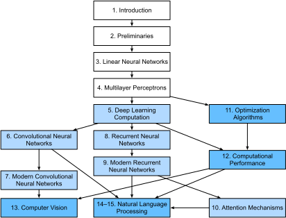

# Vorwort

Vor ein paar Jahren gab es keine Legionen von Deep Learning-Wissenschaftlern, die intelligente Produkte und Dienstleistungen bei großen Unternehmen und Startups entwickelten. Als die Jüngsten unter uns (die Autoren) ins Feld kamen, befehlte maschinelles Lernen keine Schlagzeilen in Tageszeitungen. Unsere Eltern hatten keine Ahnung, was maschinelles Lernen war, geschweige denn, warum wir es einer Karriere in Medizin oder Recht vorziehen könnten. Maschinelles Lernen war eine zukunftsweisende akademische Disziplin mit einer engen Reihe von realen Anwendungen. Und diese Anwendungen, z.B. Spracherkennung und Computervision, erforderten so viel Domänenwissen, dass sie oft als separate Bereiche betrachtet wurden, für die maschinelles Lernen eine kleine Komponente war. Neuronale Netzwerke, die Vorgänger der Deep Learning-Modelle, auf die wir uns in diesem Buch konzentrieren, wurden als veraltete Werkzeuge angesehen.

In den letzten fünf Jahren hat Deep Learning die Welt überrascht und rasante Fortschritte in so vielfältigen Bereichen wie Computer-Vision, Verarbeitung natürlicher Sprache, automatische Spracherkennung, Verstärkungslernen und statistische Modellierung vorangetrieben. Mit diesen Fortschritten in der Hand, können wir jetzt Autos bauen, die sich selbst mit mehr Autonomie als je zuvor fahren (und weniger Autonomie, als manche Unternehmen glauben könnten), intelligente Antwortsysteme, die automatisch die meisten banalsten E-Mails entwerfen, Menschen helfen, aus unterdrückend großen Posteingängen auszugraben, und Software Agenten, die die besten Menschen der Welt bei Brettspielen wie Go dominieren, ein Kunststück, das einst als Jahrzehnte entfernt gedacht wurde. Bereits jetzt haben diese Werkzeuge immer größere Auswirkungen auf Industrie und Gesellschaft, verändern die Art und Weise, wie Filme gemacht werden, Krankheiten diagnostiziert werden, und spielen eine wachsende Rolle in den Grundlagenwissenschaften — von der Astrophysik bis zur Biologie.

## Über dieses Buch

Dieses Buch stellt unseren Versuch dar, Deep Learning zugänglich zu machen und Ihnen die *Konzepte*, den *Kontext* und den *Code* beizubringen.

### Ein Medium, das Code, Mathematik und HTML kombiniert

Damit jede Computertechnologie ihre volle Wirkung erreicht, muss sie gut verstanden, gut dokumentiert und von ausgereiften, gut gepflegten Tools unterstützt werden. Die Schlüsselideen sollten klar destilliert werden, wodurch die Onboarding-Zeit minimiert wird, die erforderlich ist, um neue Praktiker auf den neuesten Stand zu bringen. Ältere Bibliotheken sollten gängige Aufgaben automatisieren, und exemplar Code sollte es Praktikern erleichtern, gängige Anwendungen an ihre Bedürfnisse anzupassen, anzuwenden und zu erweitern. Nehmen Sie als Beispiel dynamische Webanwendungen. Trotz einer großen Anzahl von Unternehmen, wie Amazon, die in den 1990er Jahren erfolgreiche datenbankgesteuerte Web-Anwendungen entwickeln, wurde das Potenzial dieser Technologie zur Unterstützung kreativer Unternehmer in den letzten zehn Jahren in weitem Maße realisiert, was zum Teil auf die Entwicklung leistungsfähiger, gut dokumentierter Frameworks.

Das Testen des Potenzials von Deep Learning stellt einzigartige Herausforderungen dar, da jede einzelne Anwendung verschiedene Disziplinen zusammenbringt. Die Anwendung von Deep Learning erfordert gleichzeitiges Verständnis (i) der Motivationen, ein Problem in einer bestimmten Weise zu werfen, (ii) die Mathematik eines bestimmten Modellierungsansatzes, (iii) die Optimierungsalgorithmen für die Anpassung der Modelle an Daten und (iv) und das erforderliche Engineering, um Modelle effizient zu trainieren; durch die Fallstricke des numerischen Computing zu navigieren und das Beste aus der verfügbaren Hardware herauszuholen. Die Lehre sowohl die kritischen Denkfähigkeiten, die erforderlich sind, um Probleme zu formulieren, die Mathematik, um sie zu lösen, als auch die Softwaretools, um diese Lösungen an einem Ort umzusetzen, stellt gewaltige Herausforderungen dar. Unser Ziel in diesem Buch ist es, eine einheitliche Ressource zu präsentieren, um Möchtegern-Praktizierende auf den Laufenden zu bringen.

Zu der Zeit, als wir dieses Buchprojekt begannen, gab es keine Ressourcen, die gleichzeitig (i) auf dem neuesten Stand waren; (ii) die gesamte Breite des modernen maschinellen Lernens mit erheblicher technischer Tiefe abdeckten; und (iii) verschachtelte Exposition der Qualität, die man von einem ansprechenden Lehrbuch mit dem sauberen ausführbaren Code erwartet , die man erwartet, in praktischen Tutorials zu finden. Wir haben viele Codebeispiele gefunden, wie man ein gegebenes Deep Learning-Framework verwendet (z. B. wie man grundlegende numerische Computing mit Matrizen in TensorFlow durchführt) oder bestimmte Techniken implementiert (z. B. Code-Snippets für LeNet, AlexNet, ResNets usw.), die über verschiedene Blogbeiträge und GitHub-Repositories verstreut sind. Diese Beispiele konzentrierten sich jedoch in der Regel auf
*wie*, um einen bestimmten Ansatz zu implementieren,
aber ließ die Diskussion über *why* bestimmte algorithmische Entscheidungen getroffen werden. Während einige interaktive Ressourcen sporadisch aufgetaucht sind, um ein bestimmtes Thema anzusprechen, z. B. die ansprechenden Blogbeiträge, die auf der Website [Distill](http://distill.pub) veröffentlicht wurden, oder persönliche Blogs, behandelten sie nur ausgewählte Themen im Deep Learning und fehlten oft der zugehörige Code. Auf der anderen Seite, während mehrere Lehrbücher entstanden sind, vor allem :cite:`Goodfellow.Bengio.Courville.2016`, die einen umfassenden Überblick über die Konzepte hinter Deep Learning bietet, heiraten diese Ressourcen die Beschreibungen nicht mit Realisierungen der Konzepte im Code, manchmal lassen Leser ahnungslos, wie sie umzusetzen sind. Darüber hinaus sind zu viele Ressourcen hinter den Paywalls kommerzieller Kursanbieter verborgen.

Wir haben uns bemüht, eine Ressource zu schaffen, die (i) für jedermann frei verfügbar sein könnte; (ii) ausreichende technische Tiefe bieten, um einen Ausgangspunkt auf dem Weg zu einem tatsächlich angewandten maschinellen Lernwissenschaftler zu werden; (iii) enthalten ausführbaren Code, der den Lesern *wie* zeigt, Probleme in der Praxis zu lösen; (iv) erlauben für schnelle Updates, sowohl von uns als auch von der Community insgesamt; und (v) ergänzt durch eine [forum](http://discuss.d2l.ai) für interaktive Diskussion technischer Details und zur Beantwortung von Fragen.

Diese Ziele waren oft in Konflikt. Gleichungen, Theoreme und Zitate werden am besten in LaTeX verwaltet und angelegt. Code wird am besten in Python beschrieben. Und Webseiten sind nativ in HTML und JavaScript. Darüber hinaus möchten wir, dass die Inhalte sowohl als ausführbarer Code, als physisches Buch, als herunterladbares PDF und als Website im Internet zugänglich sind. Gegenwärtig gibt es keine Werkzeuge und keinen Workflow, der perfekt auf diese Anforderungen abgestimmt ist, so dass wir unsere eigenen zusammenbauen mussten. Wir beschreiben unseren Ansatz im Detail in :numref:`sec_how_to_contribute`. Wir haben uns auf GitHub gesetzt, um die Quelle zu teilen und Änderungen zu ermöglichen, Jupyter Notebooks zum Mischen von Code, Gleichungen und Text, Sphinx als Rendering-Engine, um mehrere Ausgänge zu generieren, und Discourse für das Forum. Obwohl unser System noch nicht perfekt ist, bieten diese Entscheidungen einen guten Kompromiss unter den konkurrierenden Anliegen. Wir glauben, dass dies das erste Buch sein könnte, das mit einem solchen integrierten Workflow veröffentlicht wurde.

### Lernen durch Tun

Viele Lehrbücher lehren eine Reihe von Themen, die jeweils ausführlich ausführlich sind. Zum Beispiel, Chris Bishop's ausgezeichnetes Lehrbuch :cite:`Bishop.2006`, lehrt jedes Thema so gründlich, dass der Weg zum Kapitel über lineare Regression eine nicht-triviale Menge Arbeit erfordert. Während Experten dieses Buch gerade wegen seiner Gründlichkeit lieben, für Anfänger, begrenzt diese Eigenschaft seine Nützlichkeit als einleitender Text.

In diesem Buch werden wir die meisten Konzepte lehren *just in time*. Mit anderen Worten, Sie werden Konzepte in dem Moment lernen, in dem sie benötigt werden, um ein praktisches Ende zu erreichen. Während wir uns von Anfang an etwas Zeit nehmen, um grundlegende Vorbereitungen zu unterrichten, wie lineare Algebra und Wahrscheinlichkeit, möchten wir, dass Sie die Zufriedenheit des Trainings Ihres ersten Modells genießen, bevor Sie sich um mehr esoterische Wahrscheinlichkeitsverteilungen kümmern.

Abgesehen von einigen vorläufigen Notizbüchern, die einen Crashkurs im mathematischen Hintergrund bieten, führt jedes nachfolgende Kapitel sowohl eine vernünftige Anzahl neuer Konzepte ein und bietet einzelne in sich geschlossene Arbeitsbeispielen — mit realen Datensätzen. Dies stellt eine organisatorische Herausforderung dar. Einige Modelle können logischerweise in einem einzigen Notizbuch zusammengefasst werden. Und einige Ideen könnten am besten gelehrt werden, indem mehrere Modelle nacheinander ausgeführt werden. Auf der anderen Seite gibt es einen großen Vorteil, sich an eine Politik von *1 Arbeitsbeispiel, 1 Notebook* zu halten: Dies macht es Ihnen so einfach wie möglich, eigene Forschungsprojekte zu starten, indem Sie unseren Code nutzen. Kopieren Sie einfach ein Notizbuch und beginnen Sie, es zu ändern.

Wir werden den ausführbaren Code nach Bedarf mit Hintergrundmaterial verschalten. Im Allgemeinen werden wir oft auf der Seite irren, Werkzeuge zur Verfügung zu stellen, bevor wir sie vollständig erklären (und wir werden nachgehen, indem wir später den Hintergrund erklären). Zum Beispiel könnten wir *stochastische Gradientenabstieg* verwenden, bevor wir vollständig erklären, warum es nützlich ist oder warum es funktioniert. Dies hilft den Praktizierenden die notwendige Munition zu geben, um Probleme schnell zu lösen, auf Kosten der Notwendigkeit, dass der Leser uns einige kuratorische Entscheidungen vertraut.

Dieses Buch wird Deep Learning Konzepte von Grund auf lehren. Manchmal möchten wir uns mit feinen Details über die Modelle beschäftigen, die normalerweise durch die erweiterten Abstraktionen von Deep Learning-Frameworks vor dem Benutzer verborgen wären. Dies kommt vor allem in den grundlegenden Tutorials, wo wir möchten, dass Sie alles verstehen, was in einer bestimmten Ebene oder Optimierer passiert. In diesen Fällen werden wir oft zwei Versionen des Beispiels präsentieren: eine, in der wir alles von Grund auf neu implementieren, nur auf die NumPy-Schnittstelle und automatische Differenzierung verlassen, und ein anderes, praktischeres Beispiel, wo wir prägnanten Code mit Gluon schreiben. Sobald wir Ihnen beigebracht haben, wie einige Komponenten funktioniert, können wir einfach die Gluon-Version in nachfolgenden Tutorials verwenden.

### Inhalt und Struktur

Das Buch kann grob in drei Teile unterteilt werden, die in verschiedenen Farben in :numref:`fig_book_org` präsentiert werden:


:label:`fig_book_org`

* Der erste Teil umfasst Grundlagen und Vorbereitungen.
:numref:`chap_introduction` bietet eine Einführung in Deep Learning. Dann, in :numref:`chap_preliminaries`, bringen wir Sie schnell auf den neuesten Stand der Voraussetzungen für praxisorientiertes Deep Learning, wie zum Beispiel das Speichern und Bearbeiten von Daten und die Anwendung verschiedener numerischer Operationen basierend auf grundlegenden Konzepten der linearen Algebra, Kalkül und Wahrscheinlichkeit. :numref:`chap_linear` und :numref:`chap_perceptrons` decken die meisten grundlegende Konzepte und Techniken des Deep Learning, wie lineare Regression, mehrschichtige Wahrnehmungen und Regularisierung.

* Die nächsten fünf Kapitel konzentrieren sich auf moderne Deep Learning-Techniken.
:numref:`chap_computation` beschreibt die verschiedenen Schlüsselkomponenten von Deep Learning-Berechnungen und legt den Grundstein für die spätere Umsetzung komplexerer Modelle. Als nächstes führen wir in :numref:`chap_cnn` und :numref:`chap_modern_cnn` Convolutional Neural Networks (CNNs) ein, leistungsstarke Werkzeuge, die das Rückgrat der meisten modernen Computer Vision Systeme bilden. Anschließend führen wir in :numref:`chap_rnn` und :numref:`chap_modern_rnn` wiederkehrende neuronale Netze (RNNs) ein, Modelle, die zeitliche oder sequentielle Struktur in Daten nutzen und häufig für die Verarbeitung natürlicher Sprache und die Vorhersage von Zeitreihen verwendet werden. In :numref:`chap_attention` führen wir eine neue Klasse von Modellen ein, die eine Technik verwenden, die Aufmerksamkeitsmechanismen genannt wird, und sie haben vor kurzem begonnen, RNNs in der natürlichen Sprachverarbeitung zu verdrischen. In diesen Abschnitten erfahren Sie mehr über die grundlegenden Tools, die hinter den meisten modernen Anwendungen des Deep Learning stehen.

* Teil 3 behandelt Skalierbarkeit, Effizienz und Anwendungen.
Zunächst diskutieren wir in :numref:`chap_optimization` einige gängige Optimierungsalgorithmen, die verwendet werden, um Deep Learning-Modelle zu trainieren. Das nächste Kapitel, :numref:`chap_performance` untersucht mehrere Schlüsselfaktoren, die die Rechenleistung Ihres Deep Learning-Codes beeinflussen. In :numref:`chap_cv` veranschaulichen wir wichtige Anwendungen von Deep Learning in der Computervision. In :numref:`chap_nlp_pretrain` und :numref:`chap_nlp_app` zeigen wir, wie Sie Sprachrepräsentationsmodelle vortrainieren und auf natürliche Sprachverarbeitungsaufgaben anwenden können.

### Code
:label:`sec_code`

Die meisten Abschnitte dieses Buches verfügen über ausführbaren Code, weil wir glauben, dass eine interaktive Lernerfahrung im Deep Learning wichtig ist. Derzeit können bestimmte Intuitionen nur durch Versuch und Irrtum entwickelt werden, indem der Code auf kleine Weise optimiert und die Ergebnisse beobachtet werden. Idealerweise könnte uns eine elegante mathematische Theorie genau sagen, wie wir unseren Code optimieren können, um ein gewünschtes Ergebnis zu erzielen. Leider entziehen sich uns derartige elegante Theorien derzeit. Trotz unserer besten Versuche fehlen formelle Erklärungen für verschiedene Techniken, sowohl weil die Mathematik, diese Modelle zu charakterisieren, so schwierig sein kann, als auch weil ernsthafte Untersuchungen zu diesen Themen erst vor kurzem in den hohen Gang getreten sind. Wir hoffen, dass die Theorie des Deep Learning fortschreitet, zukünftige Ausgaben dieses Buches in der Lage sein werden, Einblicke in Orte zu geben, die die vorliegende Ausgabe nicht bietet.

Manchmal, um unnötige Wiederholungen zu vermeiden, kapseln wir die häufig importierten und referenzierten Funktionen, Klassen usw. in diesem Buch im Paket `d2l`. Für jeden Block wie eine Funktion, eine Klasse oder mehrere Importe, die im Paket gespeichert werden sollen, markieren wir es mit `# @save `. Wir bieten eine detaillierte Übersicht über diese Funktionen und Klassen in :numref:`sec_d2l`. Das Paket `d2l` ist leicht und benötigt nur die folgenden Pakete und Module als Abhängigkeiten:

```{.python .input  n=1}
#@tab all
#@save
import collections
from collections import defaultdict
from IPython import display
import math
from matplotlib import pyplot as plt
import os
import pandas as pd
import random
import re
import shutil
import sys
import tarfile
import time
import requests
import zipfile
import hashlib
d2l = sys.modules[__name__]
```

:begin_tab:`mxnet`
Der größte Teil des Codes in diesem Buch basiert auf Apache MXNet. MxNet ist ein Open-Source-Framework für Deep Learning und die bevorzugte Wahl von AWS (Amazon Web Services) sowie vielen Hochschulen und Unternehmen. Der gesamte Code in diesem Buch hat Tests unter der neuesten MXNet-Version bestanden. Aufgrund der schnellen Entwicklung von Deep Learning, einige Code
*in der Print-Edition* funktioniert möglicherweise in zukünftigen Versionen von MxNet nicht ordnungsgemäß.
Wir planen jedoch, die Online-Version auf dem neuesten Stand zu halten. Sollten solche Probleme auftreten, wenden Sie sich bitte an :ref:`chap_installation`, um Ihre Code- und Laufzeitumgebung zu aktualisieren.

Hier ist, wie wir Module aus MXnet importieren.
:end_tab:

:begin_tab:`pytorch`
Der größte Teil des Codes in diesem Buch basiert auf PyTorch. PyTorch ist ein Open-Source-Framework für Deep Learning, das in der Forschungsgemeinschaft sehr beliebt ist. Der gesamte Code in diesem Buch hat Tests unter dem neuesten PyTorch bestanden. Aufgrund der schnellen Entwicklung von Deep Learning, einige Code
*in der Print-Edition* funktioniert möglicherweise in zukünftigen Versionen von PyTorch nicht richtig.
Wir planen jedoch, die Online-Version auf dem neuesten Stand zu halten. Sollten solche Probleme auftreten, wenden Sie sich bitte an :ref:`chap_installation`, um Ihre Code- und Laufzeitumgebung zu aktualisieren.

Hier ist, wie wir Module aus PyTorch importieren.
:end_tab:

:begin_tab:`tensorflow`
Der größte Teil des Codes in diesem Buch basiert auf TensorFlow. TensorFlow ist ein Open-Source-Framework für Deep Learning, das sowohl in der Forschung als auch in der Industrie sehr beliebt ist. Der gesamte Code in diesem Buch hat Tests unter dem neuesten TensorFlow bestanden. Aufgrund der schnellen Entwicklung von Deep Learning, einige Code
*in der Print-Edition* funktioniert möglicherweise nicht ordnungsgemäß in zukünftigen Versionen von TensorFlow.
Wir planen jedoch, die Online-Version auf dem neuesten Stand zu halten. Sollten solche Probleme auftreten, wenden Sie sich bitte an :ref:`chap_installation`, um Ihre Code- und Laufzeitumgebung zu aktualisieren.

Hier ist, wie wir Module aus TensorFlow importieren.
:end_tab:

```{.python .input  n=1}
#@save
from mxnet import autograd, context, gluon, image, init, np, npx
from mxnet.gluon import nn, rnn
```

```{.python .input  n=1}
#@tab pytorch
#@save
import numpy as np
import torch
import torchvision
from torch import nn
from torch.nn import functional as F
from torch.utils import data
from torchvision import transforms
```

```{.python .input  n=1}
#@tab tensorflow
#@save
import numpy as np
import tensorflow as tf
```

### Zielgruppe

Dieses Buch richtet sich an Studenten (Bachelor oder Absolvent), Ingenieure und Forscher, die ein solides Verständnis der praktischen Techniken des Deep Learning suchen. Da wir jedes Konzept von Grund auf neu erklären, ist kein vorheriger Hintergrund in Deep Learning oder Machine Learning erforderlich. Die vollständige Erklärung der Methoden des Deep Learning erfordert einige Mathematik und Programmierung, aber wir gehen nur davon aus, dass Sie mit einigen Grundlagen kommen, einschließlich (die Grundlagen der) linearen Algebra, Kalkül, Wahrscheinlichkeit und Python-Programmierung. Darüber hinaus bieten wir im Anhang eine Auffrischung über die meisten der Mathematik, die in diesem Buch behandelt werden. Meistens werden wir Intuition und Ideen vor mathematischer Strenge priorisieren. Es gibt viele tolle Bücher, die den interessierten Leser weiter führen können. So umfasst die lineare Analyse von Bela Bollobas :cite:`Bollobas.1999` lineare Algebra und funktionale Analyse in großer Tiefe. All of Statistics :cite:`Wasserman.2013` ist ein toller Leitfaden für die Statistik. Und wenn Sie Python noch nicht verwendet haben, können Sie diese [Python tutorial](http://learnpython.org/) durchlesen.

### Forum

Im Zusammenhang mit diesem Buch haben wir ein Diskussionsforum unter [discuss.d2l.ai](https://discuss.d2l.ai/) ins Leben gerufen. Wenn Sie Fragen zu einem beliebigen Abschnitt des Buches haben, finden Sie den Link zur Diskussionsseite am Ende jedes Kapitels.

## Danksagungen

Wir sind den Hunderten von Beitragenden sowohl für den englischen als auch für die chinesischen Entwürfe schuldet. Sie haben dazu beigetragen, den Inhalt zu verbessern und wertvolles Feedback zu geben. Insbesondere danken wir jedem Verfasser dieses englischen Entwurfs dafür, dass er es für alle besser gemacht hat. Ihre GitHub-IDs oder Namen sind (in keiner bestimmten Reihenfolge): alxnorden, avinashingit, bowen0701, brettkoonce, Chaitanya Prakash Bapat, cryptonaut, Davide Fiocco, edgarroman, gkutiel, John Mitro, Liang Pu, Rahul Agarwal, Mohamed Ali Jamaoui, Michael (Stu) Stewart, Mike, Müller, NrauschMayr, Prakhar Srivastav, traurig, sfermigier, Sheng Zha, sundeepteki, topecongiro, tpdi, fadennudeln, Vishwesh Kapoor, Vishwesh Ravi Shrimali, YaYab, Yuhong Chen, Evgeniy Smirnov, lgov, Simon Corston-Oliver, Igor Dzreyev, Ha Nguyen, pmuens, Andrei Lukovenko, Senenko, vfdev-5, dsweet, Mohammad Mahdi Rahimi, Abhishek Gupta, uwsd, DomKm, Lisa Oakley, Bowen Li, Aarush Ahuja, Prasanth Buddareddygari, brianhendee, mani2106, mtn, lkevinzc, caojilin, Lakshya, Fiete Lüer, Surbhi Vijayvargeeya, Muhyun Kim, dennismalmgren, adursun, liudh Dagar, Nz, Pedro Larroy, lgov, ati-ozgur, Jun Wu, Matthias Blume, Lin Yuan, geogunow, Josh Gardner, Maximilian Böther, Rakig Islam, Leonard Lausen, Abhinav Upadhyay, rongruosong, Steve Sedlmeyer, Ruslan Baratov, Rafael Schlatter, liusy182, Giannis Pappas, ati-ozgur, qbaza, dchoi77, Adam Gerson, Phuc Le, Mark Atwood, Christabella, vn09, Haibin, Haibin jjangga0214, RichyChen, noelo, hansent, Giel Dops, dvincent1337, weiß3vil, Peter Kulits, codypenta, joseppinilla, ahmaurya, karolszk, heytitle, Peter Goetz, rigtorp, tiepvupsu, sfilip, mlxd, Kale-ab Tessera, Sanjar Adilov, Matteoferrara, hsneto, Katarzyna Biesialska, Gregory Bruss, duythanhvn, paulaurel, graytowne, minhduc0711, sl7423, Jaedong Hwang, Yida Wang, cys4, clhm, Jean Kaddour, austinmw, trebeljahr, tbaums, cuongvng, pavelkomarov, vzlamal, NotAnotherSystem, J-Arun-Mani, jancio, eldarkurtic, die-groß-Shazbot, doctorcolossus, gducharme, cclauss, Daniel-Mietchen, hoonose, biagiom, abhinavsp0730, jonathanathanathanus andall, ysraell, Nodar Okroshiashvili, Ugurkap, Jiyang Kang, StevenJoks, Tomer Kaftan, liweiwp, netyster, ypandya, NishantTharani, heiligerl.

Wir danken Amazon Web Services, insbesondere Swami Sivasubramanian, Raju Gulabani, Charlie Bell und Andrew Jassy für ihre großzügige Unterstützung beim Schreiben dieses Buches. Ohne die verfügbare Zeit, Ressourcen, Diskussionen mit Kollegen und kontinuierliche Ermutigung wäre dieses Buch nicht geschehen.

## Zusammenfassung

* Deep Learning hat die Mustererkennung revolutioniert und Technologie eingeführt, die jetzt eine breite Palette von Technologien unterstützt, einschließlich Computersicht, Verarbeitung natürlicher Sprache, automatische Spracherkennung.
* Um Deep Learning erfolgreich anzuwenden, müssen Sie verstehen, wie Sie ein Problem darstellen, die Mathematik der Modellierung, die Algorithmen für die Anpassung Ihrer Modelle an Daten und die Engineering-Techniken, um alles zu implementieren.
* Dieses Buch präsentiert eine umfassende Ressource, einschließlich Prosa, Zahlen, Mathematik und Code, alles an einem Ort.
* Um Fragen zu diesem Buch zu beantworten, besuchen Sie unser Forum unter https://discuss.d2l.ai/.
* Alle Notebooks stehen auf GitHub zum Download zur Verfügung.

## Übungen

1. Registrieren Sie ein Konto auf dem Diskussionsforum dieses Buches [discuss.d2l.ai](https://discuss.d2l.ai/).
1. Installieren Sie Python auf Ihrem Computer.
1. Folgen Sie den Links am unteren Rand des Abschnitts zum Forum, wo Sie Hilfe suchen und das Buch diskutieren und Antworten auf Ihre Fragen finden können, indem Sie die Autoren und eine breitere Community einbringen.

:begin_tab:`mxnet`
[Discussions](https://discuss.d2l.ai/t/18)
:end_tab:

:begin_tab:`pytorch`
[Discussions](https://discuss.d2l.ai/t/20)
:end_tab:

:begin_tab:`tensorflow`
[Discussions](https://discuss.d2l.ai/t/186)
:end_tab:
